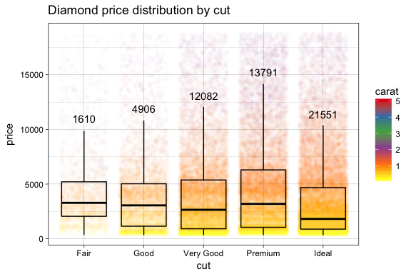
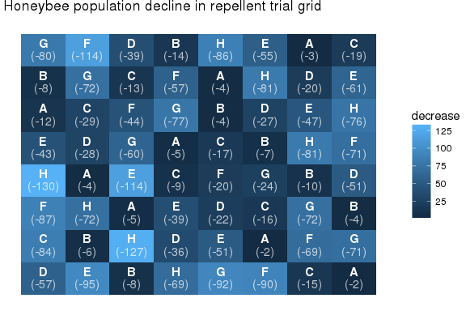

ggpackets 
======================================================================================

[](https://travis-ci.org/dgkf/ggpackets) [](https://codecov.io/gh/dgkf/ggpackets)

Overview
--------

Take a look at the **[ggpackets project page](https://dgkf.github.io/ggpackets/)**!

Easily build components of ggplots without sacraficing the ease of ggplot's layer parameters and construction syntax.

Get Involved
------------

There are plenty of ways to help contribute:

1.  **File issues!**
    Found a bug? Think the syntax looks ugly? Don't like the name? Tell me! [Issues](https://github.com/dgkf/ggpackets/issues) are the best way to start the conversation.

2.  **Write documentation!**
    More resources always helps. If you use the package and would feel comfortable writing about what you find useful, feel free to wrap it all into a Rmarkdown file and include it with the vignettes.

3.  **Write Unit Tests!**
    There's some pretty sophisticated manipulations going on under the hood to make everything as clean as possible, because of that it's important to make sure everything stays working the way we expect it to. Unit test contributions always welcome!

4.  **Contribute Code**
    Last but not least, code contributors are welcome. Reach out and get in touch if you're passionate about the goal of the project.

Quick Start
-----------

Define common ggplot layer sets together into a singled object. Connect all your plots with a single plot component definition and debug one central location. Build beautiful templates and save them once, reuse them easily and without having to abandon the ggplot construction framework.

``` r
ggpk_box_and_scatter <- ggpacket() +
  geom_point(position = position_jitter(width = 0.4), alpha = 0.02) + 
  geom_boxplot(outlier.shape = NA, fill = NA, color = 'black') + 
  geom_text(stat = 'summary', vjust = -1, fun.data = function(d) c(
    y = quantile(d, 0.75, names = F) + 1.5 * IQR(d),
    label = length(d)
  )) + 
  theme_linedraw() + 
  scale_color_distiller(palette = "Set1")
```

Now we can use that template repeatedly with a much simpler ggplot call

``` r
ggplot(diamonds, aes(x = cut, y = price, color = carat)) + 
  ggpk_box_and_scatter + 
  ggtitle('Diamond price distribution by cut')
```



Handle custom arguments & parameter propegation
-----------------------------------------------

Use the `ggpack()` function to bundle ggplot layers and give them a name. The name will serve as a prefix for subsetting arguments passed to it. These propegated parameters can be overridden by including them as ellipses arguments.

``` r
ggpk_labelled_heatmap <- function(...) {
  ggpack(geom_tile, id = 'tile', color = NA, ...) + 
  ggpack(geom_text, id = 'text1', color = 'white', 
         vjust = -0.3, fontface = 'bold', ...) +
  ggpack(geom_text, id = 'text2', color = 'white',
         vjust = 1.1, alpha = 0.7, ...) + 
  theme_void()
} 
```

We can specify an aesthetic for a subset of the layers using the layer `id`.

``` r
ggplot(as.data.frame(OrchardSprays)) + 
  aes(x = rowpos, y = colpos, label = treatment, fill = decrease) + 
  ggpk_labelled_heatmap(text2.label = sprintf("(-%i)", decrease)) + 
  ggtitle('Honeybee population decline in repellent trial grid')
```


