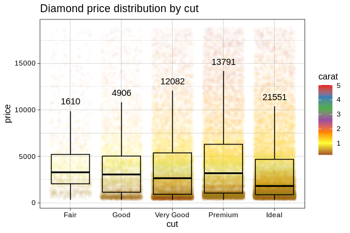
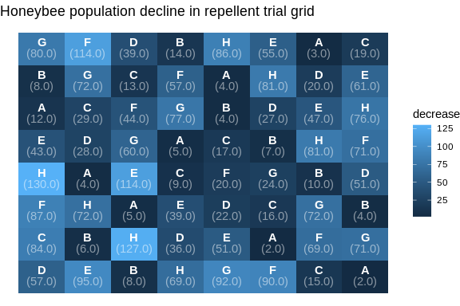

# ggpackets 

[](https://cran.r-project.org/package=ggpackets)
[](https://github.com/dgkf/ggpackets/actions?query=workflow%3AR-CMD-check)
[](https://codecov.io/gh/dgkf/ggpackets)

## Overview

Take a look at the **[ggpackets project
page](https://dgkf.github.io/ggpackets/)**\!

Easily build components of ggplots without sacraficing the ease of
ggplot’s layer parameters and construction syntax.

### Installation

`ggpackets` is not yet available on CRAN. Until it is, you can install
the most recent development version using the short script below:

``` r
if (!require(devtools, quietly = TRUE)) 
  install.packages('devtools')

devtools::install_github('dgkf/ggpackets', build_vignettes = TRUE)
```

## Get Involved

There are plenty of ways to help contribute:

1.  **File issues\!**  
    Found a bug? Think the syntax looks ugly? Don’t like the name? Tell
    me\! [Issues](https://github.com/dgkf/ggpackets/issues) are the best
    way to start the conversation.

2.  **Write documentation\!**  
    More resources always helps. Found a function unintuitive? Example
    code and improved function descriptors would be helpful. If you use
    the package and would feel comfortable writing about a topic not yet
    covered in a vignette, feel free to contribute a new vignette for
    it.

3.  **Write Unit Tests\!**  
    There’s some pretty sophisticated manipulations going on under the
    hood to make everything as clean as possible, because of that it’s
    important to make sure everything stays working the way we expect it
    to. Unit test contributions always welcome\!

4.  **Contribute Code\!**  
    Last but not least, code contributors are welcome. Reach out and get
    in touch if you’re passionate about the goal of the project.

## Quick Start

Define common ggplot layer sets together into a singled object. Connect
all your plots with a single plot component definition and debug one
central location. Build beautiful templates and save them once, reuse
them easily and without having to abandon the ggplot construction
framework.

``` r
ggpk_box_and_scatter <- ggpacket() +
  geom_point(position = position_jitter(width = 0.4), alpha = 0.02) + 
  geom_boxplot(outlier.shape = NA, fill = NA, color = 'black') + 
  geom_text(stat = 'summary', vjust = -1, fun.data = function(d) c(
    y = quantile(d, 0.75, names = F) + 1.5 * IQR(d),
    label = length(d)
  )) + 
  theme_linedraw() + 
  scale_color_distiller(palette = "Set1")
```

Now we can use that template repeatedly with a much simpler ggplot call

``` r
ggplot(diamonds, aes(x = cut, y = price, color = carat)) + 
  ggpk_box_and_scatter() + 
  ggtitle('Diamond price distribution by cut')
```



## Handle custom arguments & parameter propegation

In addition to simply wrapping multiple `ggplot2` layers, `ggpackets`
can streamline a number of complicated plotting scenarios such as
passing arguments to sets of layers, setting default argument values
with scoped overrides, routing aesthetic mappings to be reused within
specific layers for other aesthetics and scoping data usage over a set
of layers.

``` r
ggpk_labelled_heatmap <- function(...) {
  ggpacket(...) %+%
    geom_tile(.id = 'tile', color = NA, ...) %+% 
    geom_text(.id = c("text", "text1"), color = "black", vjust = -0.3, 
      fontface = "bold", ...) %+%
    geom_text(.id = c("text", "text2"), 
      aes(label = sprintf("(%.1f)", ..fill..)), 
      color = "black", vjust = 1.1, ...) %+%
    theme_void()
} 
```

In this function we make use of a number of these specialized behaviors.

1.  `.id` parameters are set to tag specific layers with an identifier,
    which can be used to prefix arguments to route them to a subset of
    the `ggpacket` layers. Multiple IDs can be used, and arguments will
    filter down into that layer if they match any of the provided IDs.
2.  Ellipsis are first passed to `ggpacket(...)`, which will pass them
    on as default values to all `ggpacket` layers.
3.  Ellipsis are also passed at the tail end of each layer call,
    allowing arguments to mask default values. The placement of the
    ellipsis determines whether arguments will override or be overridden
    by the existing parameters. After expanding the ellipsis, the last
    instance of each argument is used to build the call.
4.  Aesthetics are rerouted using the specialized `..<aesthetic>..`
    syntax.
5.  We use `%+%` instead of the commonly-used `+` to add layers
    together, which allows `ggpackets` to accept non-standard arguments
    before ggplot sends us warnings about them.

<!-- end list -->

``` r
ggplot(as.data.frame(OrchardSprays)) + 
  aes(x = rowpos, y = colpos, label = treatment, fill = decrease) + 
  ggpk_labelled_heatmap(text.color = "white", text2.alpha = 0.5) + 
  ggtitle('Honeybee population decline in repellent trial grid')
```


